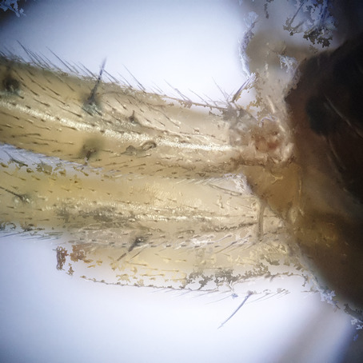
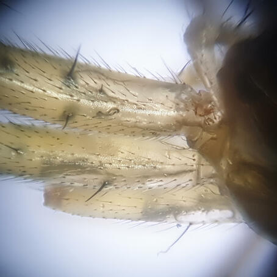

# rolling focus

Experiments in real-time merging low depth of field image series. 

In particular taking pictures through a microscope, using an android device.
DOF in microscopy is very low, hence the need to apply focus stacking. 

I often 
want to apply enfuse on image stacks of up to 300 pictures, which is 
prohibitively slow for a live preview. I therefore resorted to OpenCV to produce
quick-and-dirty focus detection and crop and paste the results along the 
detected areas. The result is a pasted focus stack, as opposed to a 
blended/fused focus stack.

### Example

Here are some hairy spiders. 

The instant preview with merged masks

The result of running enfuse over the entire image stack below.

### Setup (roughly)

* Connect your phone via USB and adb connect. 
* Attach it to the eyepiece of a microscope, or maybe on a digiscope?
* Open your favorite camera app
* Adjust the coordinates in getpic.sh to hit the shutter button
* Adjust the download path in getpic.sh to download from the correct folder
* Run the roll.sh loop, which keeps taking pictures, downloading them and
  merging them together until you press crtl-c
* Continuously adjust the focus of the picture, for example by moving your
  specimen table up or down.
* Enjoy the live preview
* Ctrl-C to abort
* fuse the image collection with enfuse and compare the results.

### Requirements

* adb connection to your android device
* python3-opencv for the live preview
* enfuse for the final results